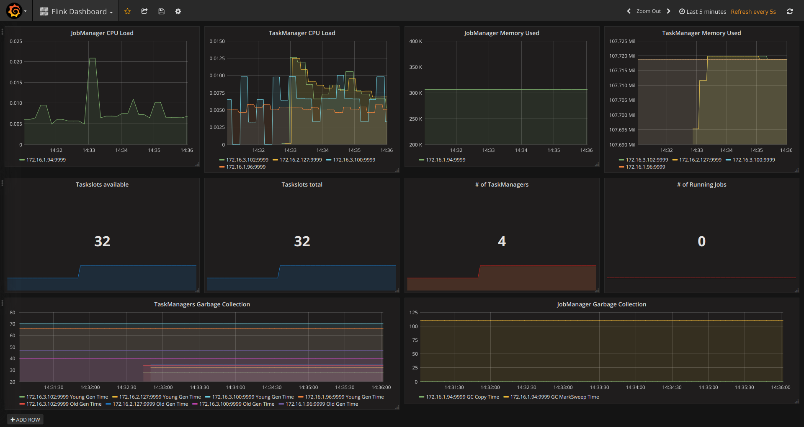

# Flink K8s cluster setup
This repository hosts manifests to configure a Kubernetes cluster with
Flink monitored by Prometheus and Grafana using service discovery. Flink
instances are automatically recognized and scraped by Prometheus.

The Docker image used in this setup can be found
[here](https://hub.docker.com/r/wzorgdrager/flink-prometheus).

## Prerequisites
- Kubernetes setup with
[kubectl](https://kubernetes.io/docs/tasks/tools/install-kubectl/)
installed.

## TL;DR
```sh
git clone https://github.com/wzorgdrager/flink-k8s
kubectl apply -R -f ./flink-k8s/
kubectl port-forward -n monitoring service/grafana 3000:3000
```

Access Grafana Flink Dashboard on
[localhost:3000](http://localhost:3000/dashboard/db/flink-dashboard?refresh=5s&orgId=1). This might take a few minutes.

Grafana login details  
username: **flink**  
password: **flink-awesome**  

## Installation

Clone the repository and apply all configurations:
```sh
git clone https://github.com/wzorgdrager/flink-k8s
cd flink-k8s
kubectl apply -f ./01-prometheus/
kubectl apply -f ./02-flink/
kubectl apply -f ./03-grafana/
```

To see the service discovery working scale the TM instances from **two**
to **four**:  
`kubectl -n flink  scale deployment flink-taskmanager
--replicas=4`:

You can see these instances pop-up on the [Grafana
dashboard](http://localhost:3000/dashboard/db/flink-dashboard?refresh=5s&orgId=1):  


## Architecture
